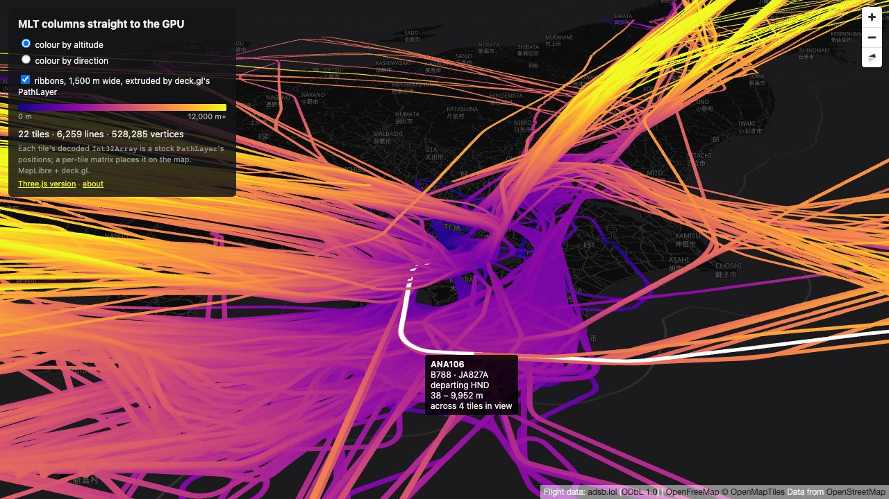

# deck.gl

The deck.gl page (`deckgl.html`) draws the same tiles with the same styles, hovering and tooltip as the
Three.js page, with stock deck.gl 9.4 layers on the same MapLibre map: a `TileLayer` that renders one
`PathLayer` per tile, in a `MapboxOverlay` interleaved with the basemap. It writes no shader. The question is
how close a stock deck.gl layer gets to handing the decoded columns to the GPU as they are.

## The decoded vertices as `PathLayer` positions

Each tile's `PathLayer` gets binary data ([`PathData`](../src/deckgl/tile.ts)): the lines' start vertices
(`LineIds.lineStart`) as `startIndices`, and the layer's decoded `Int32Array` as `getPath`. With
`_pathType: "open"`, deck.gl takes the lines as already normalised: it skips copying them into its own position
buffer and uploads the given array as its `vertexPositions` attribute, read at four vertex offsets for each
segment's neighbours, much as the Three.js page reads one buffer twice.

The array is integers, and the attribute is a `vec3` of floats in deck.gl's shader. luma.gl decides whether to
bind an attribute as integers by the shader's declaration, not by the data, so it binds the `Int32Array` with
`vertexAttribPointer`, and the GPU converts each integer to a float on fetch. No CPU conversion and no copy:
the attribute's value in the running page is the decoded array itself.

## Placing a tile: `CARTESIAN` and a model matrix

Tile coordinates are placed the way deck.gl's own `MVTLayer` places its tiles: in `COORDINATE_SYSTEM.CARTESIAN`,
with a per-tile `coordinateOrigin` (the tile's north-west corner in deck.gl's common space, 512 units across
the world, y pointing north) and a `modelMatrix` that scales tile coordinates to common units and flips y.
[`deckPlacement`](../src/deckgl/tile.ts) builds both from the shared `TileFrame`. The model matrix also turns
the z grid into metres (`z · 10^zStep − 10000`).

### Altitude

In `CARTESIAN` coordinates deck.gl takes z as metres and multiplies it by common units per metre, but which
metre depends on its projection mode, which switches at zoom 12:

| Viewport zoom | deck.gl's metre                                                         | The tile's `modelMatrix` adds    |
| ------------- | ----------------------------------------------------------------------- | -------------------------------- |
| below 12      | at the equator, everywhere                                              | `cosh(π (1 − 2y))` at its centre |
| 12 and above  | at the viewport centre's latitude, corrected linearly with y per vertex | nothing                          |

Below zoom 12, z alone would put the flights around Tokyo about 18 % too low (`1 / cos 35°` is 1.22), and
they would jump up at zoom 12. Each tile therefore has two matrices, and
[`FlightsLayer.getSubLayerPropsByTile`](../src/deckgl/layer.ts) picks one by the viewport's zoom. deck.gl does
not export its projection modes; the threshold is `Viewport.projectionMode`'s `zoom < 12`, repeated as
`OFFSET_ZOOM`.

Below zoom 12 the factor is the tile centre's, so it is off within the tile by about `tan(lat) · Δlat`: about
1.4 % at the edges of a zoom 8 tile at 35° N, as [Shaders](shaders.md#altitude-in-mercator-units) works out
for a per-tile factor, and more across the zoom 3 to 5 tiles drawn when zoomed out. The Three.js page computes
the factor per vertex. At the initial view, and just below and above zoom 12, the deck.gl lines cover all of
the Three.js page's line pixels in screenshots of the same view.

## Colours

`PathLayer` takes a colour per vertex from binary data, so [`deckTile`](../src/deckgl/tile.ts) computes two
per tile when it loads, with the shared [`vertexColors`](../src/shared/style.ts): by altitude, from the ramp at
each vertex's `toElevation`, and by direction, from the line's style texel. The colours can only be given
inside the binary data, so each tile keeps one data object per colour mode, sharing the positions and row
indexes. Switching the colour mode hands each `PathLayer` the other object, which deck.gl takes as new data:
it recomputes the segment types and uploads the tile's attributes again, once per switch. The Three.js page instead does both in its
fragment shader, from a ramp texture and a style texture of one texel per line.

## Picking and highlighting

deck.gl picks by itself: it renders picking colours, reads the pixel under the cursor within `pickingRadius`
(the same 4 px), and reports the sublayer and the row. The row is normally the path, here a line. The
binary data also sets `rowIndexes`, the attribute deck.gl derives picking colours from, to the **feature** of
each vertex, so:

- a hover reports the feature, and every line of a feature is picked as it;
- `highlightedObjectIndex`, which deck.gl compares with each vertex's picking colour, highlights every line of
  that feature in the tile at once.

The cross-tile highlight is then what `MVTLayer` does for hovering. `FlightsLayer` has `autoHighlight` on, so
deck.gl's picker passes every hover to its `_updateAutoHighlight`, which keeps the hovered feature id in the
layer's **state**, not its props. `getSubLayerPropsByTile` sets each tile's `highlightedObjectIndex` to the
feature with that id in the tile, from the shared `featureOfId` map, or −1.

State rather than props, because `TileLayer` drops every tile's cached sublayer on any change of its props,
while a change of state only re-runs `getSubLayerPropsByTile`, which clones the sublayers whose highlight
index changed: the tiles of the previous flight and of the new one, 4 to 7 of 22 at the initial view, and none
while the cursor moves along one flight. A clone keeps its `data`, so it recomputes no attribute and
re-tessellates nothing; only the highlight uniform changes.

deck.gl compares `data` by reference and rebuilds every attribute of a layer whose `data` is a different
object, so the data objects are built once per tile, when it loads, and every `PathLayer` of the tile gets the
same one. That matters when the sublayers are rebuilt, on a colour-mode or ribbons switch. (Counted by
wrapping deck.gl's attribute and tesselator updates in the running page: none across hovers and the ribbons
toggle, one tessellation per tile on a colour-mode switch.)

One gap of deck.gl 9.4: when the pointer leaves the canvas, its picker looks for the viewport under the leave
position (−1, −1), finds none, and returns before telling any layer, so `_updateAutoHighlight` is not called
and a highlight would stay. `FlightsLayer` therefore also clears it on the canvas's `pointerleave`, listened to
from `initializeState`; deck.gl hands the same state to every instance of the layer it matches, so the listener
of the first instance clears the current state.

The tooltip comes from the shared [`describeFeature`](../src/shared/hit.ts) over the tiles the `TileLayer`
draws (its visible tiles, ancestors standing in for loading tiles included), so both pages show the same text
for the same flight. deck.gl reports a hover every frame the cursor moves, so the page computes the text again
only when the hovered feature changes, or when the tiles in view have been reloaded (`onViewportLoad`). When
the pointer leaves the canvas, deck.gl still calls `onHover`, with nothing picked, which hides the tooltip.

## Ribbons

The ribbons are the same `PathLayer` with other props: `billboard: false` extrudes the path on the ground
plane instead of facing the screen, `widthUnits: "meters"` with a width of 1,500 m, and `jointRounded: true`
for round joins. deck.gl joins and extrudes in its vertex shader, so toggling ribbons changes uniforms only and
takes about two frames, where the Three.js page tessellates on the CPU for about 230 ms
([Ribbons](ribbons.md#cost)). Two differences:

- **The width** is converted from metres at the viewport centre, for the whole view, not at each point.
- **Joins** are always round; the Three.js page mitres turns of up to 15°. Ends are butt ends on both.

## What is uploaded

At the initial view (22 tiles, 528,285 vertices, 6,259 lines), per vertex:

|                    | Three.js page                    | deck.gl page                                                               |
| ------------------ | -------------------------------- | -------------------------------------------------------------------------- |
| Uploaded           | 16 B: position 12 B, line id 4 B | 20 B: position 12 B, colour 3 B, row index 4 B, deck.gl's segment type 1 B |
| CPU work           | one line id                      | metres, two colours and the row index; deck.gl adds the segment type       |
| Colour mode switch | one uniform                      | the other data object: segment types recomputed, attributes uploaded again |
| Ribbons            | tessellated on the CPU           | props of the same layer                                                    |
| Shaders of our own | line and pick                    | none                                                                       |

## Smaller differences

- **Line width.** deck.gl 9.4's `PathLayer` antialiases its edges with half a pixel of coverage on each side,
  so the 1.5 px lines look slightly wider than the Three.js page's.
- **Tile selection and cache** are `TileLayer`'s: which tiles it loads, how it stands in ancestors while
  children load, and how many it keeps. The stats count the tiles of the last viewport loaded
  (`onViewportLoad`).
- **Empty tiles.** The server answers a missing tile with 404; the shared `fetchLineTile` returns `null` for
  it, and for a tile with no segment, as on the Three.js page. `getTileData` is a prop rather than an
  overridden method, because `TileLayer` fills in the tile's URL from the `data` template only for the prop.
- **Decoding** runs on the main thread, as on the Three.js page; see [Limitations](extending.md).
