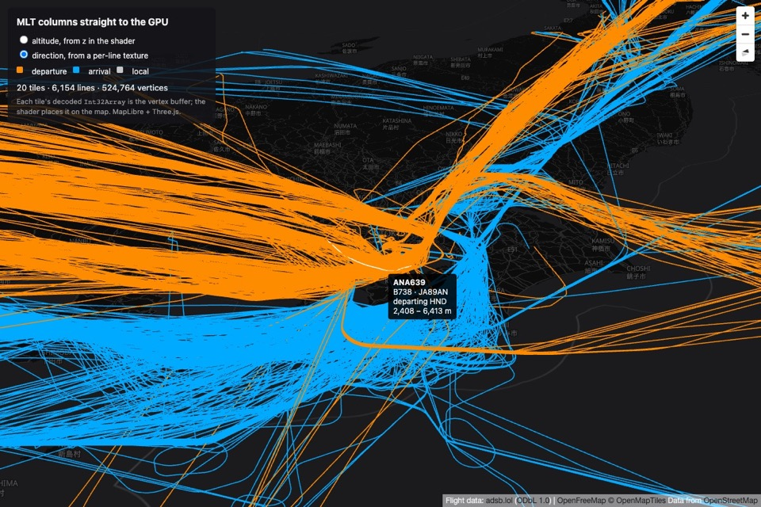

# Picking

Hovering a line shows its flight and highlights it. The line under the cursor is found on the GPU, by drawing
line ids instead of colours into a single pixel and reading that pixel back. Picking lines on the CPU means
projecting every visible vertex to the screen on each mouse move; here the cost of a pick is one extra draw of the visible tiles into a 1 × 1 target, independent of the number of vertices on the CPU.



## Flow

```text
mousemove ─▶ main.ts: keep the latest point; one pick in flight at a time
              └─▶ lines.pick(x, y): record it, triggerRepaint()
                   └─▶ next MapLibre render: renderPick(x, y) before renderDraw()
                        ├─ draw ids of all drawn tiles into the 1 × 1 target
                        ├─ queue the pixel's readback; back to the canvas for the draw pass
                        └─ … GPU done (polled) ─▶ decode id ─▶ highlight, tooltip
```

The pick has to run inside MapLibre's render callback: that is where the projection matrix of the current
frame is known and where the GL context is in a state Three.js may use. So `pick()` only records the request
and asks for a frame; it returns a promise that the readback resolves.

[`main.ts`](../src/main.ts) keeps one pick in flight: mouse moves while it runs only overwrite the pending
point, and when the pick resolves the latest point is picked next. Positions in between are skipped. If a new
`pick()` call arrives before the previous one was rendered, the previous promise resolves with `null`.

## Seeing one pixel: the pick matrix

Rendering the whole canvas to read one pixel would waste a full-screen pass. Instead the pick pass renders into
a 1 × 1 target, with a projection that maps the cursor's pixel onto that whole target
([`pickMatrix`](../src/transform.ts)):

```ts
// (nx, ny): the centre of CSS pixel (px, py) in normalised device coordinates
return new Matrix4().makeScale(width, height, 1).setPosition(-width * nx, -height * ny, 0);
```

Applied after the map's projection, it turns NDC `x` into `width · (x − nx)`: the pixel's centre goes to 0,
and its edges, `1 / width` NDC either side, go to ±1. The 1 × 1 viewport therefore covers exactly that pixel,
and everything else falls outside the clip volume and is discarded before rasterisation. The matrix is linear
in homogeneous coordinates (it scales and offsets `x` and `y` by multiples of `w`), so it composes with a
perspective projection without changing depth.

The same vertex shader runs, so the lines take the same screen-space shape. Two uniforms differ:

- `uResolution` is `(1, 1)`: after the pick matrix, one CSS pixel spans the full NDC range in both axes, so
  pixel offsets convert to NDC the same way in `x` and `y`.
- `uWidth` is the line width plus twice the pick radius (1.5 + 2 × 4 px). A line whose centre passes within
  4.75 px of the cursor's pixel covers it.

The target has its own depth buffer, cleared per pick, so where several lines cover the pixel, the nearest one
wins. Basemap features do not occlude picks.

## Pick ids

The pixel has to say which line of which tile. [`pick-id.ts`](../src/pick-id.ts) packs both into 32 bits:

```text
 31            20 19                   0
┌────────────────┬──────────────────────┐
│  tile slot     │  line id + 1         │      0 = nothing drawn
└────────────────┴──────────────────────┘
```

- **The slot** is the tile's index in this frame's list of drawn tiles, 12 bits, so up to 4,096 tiles. The
  pick pass throws if more are drawn.
- **The line id**, plus one so that the cleared pixel's 0 means nothing, has 20 bits, so up to about a
  million lines per tile; the busiest tile here has a few hundred.
- The fragment shader writes the id's four bytes as `RGBA8` (see [Shaders](shaders.md#pick-fragment-shader)).
  The target is not multisampled, and the materials are opaque, so blending is off and the bytes are stored
  as written.

`decodePickId` reassembles the bytes and splits them again; its tests round-trip the extremes.

## Asynchronous readback

`readRenderTargetPixelsAsync` issues `readPixels` into a pixel buffer object, inserts a fence, and polls the
fence every 4 ms before copying the four bytes out. Unlike a plain `readPixels`, it does not stall the CPU
until the GPU has finished the frame.

Two details matter, because the promise resolves after the frame that issued it:

- **The render target is restored at once.** The readback is queued when the call is made, so `renderPick`
  switches back to the canvas before awaiting it. Restoring it after the `await` would leave the draw pass of
  the same frame drawing into the 1 × 1 target, so the lines would vanish from the canvas for one frame on
  every pick.
- **Slots resolve against the frame they were drawn in.** By the time the bytes arrive, later frames may have
  replaced the list of drawn tiles, so the pick keeps the list it was drawn with and looks the slot up there.

## From id to tooltip

With the tile and the line id, everything else comes from the decoded columns on the CPU, for one line:

- `featureOfLine[line]` gives the feature, and `columnValue` gives its value in each property column, or
  `undefined` where it has none.
- `featureGeometry` gives the feature's lines as views; the one whose first vertex has this line id is the
  picked part of a `MultiLineString`, and its lowest and highest `z`, through `toElevation`, give the
  altitude range shown.

The highlight is a uniform: the hovered tile's draw material gets `uHighlight = line`, and the fragment shader
draws that line white. No geometry is rebuilt.

## Limitations

- **The position along the line is not known**, only the line, so the tooltip shows the line's altitude range
  rather than the altitude under the cursor. Writing the segment index (the instance id) instead of the line
  id would give it; the line is then found from `lineOfVertex`.
- **The highlight is tile-local.** A flight crosses many tiles, each with its own line ids, so only the part
  in the hovered tile turns white. Highlighting the whole flight needs a key shared across tiles, such as a
  feature id column, matched in each tile.
- **A tile drawn in two world copies** has one pick material, so both copies write the slot set last. Both
  slots name the same tile, so the result is still right.
